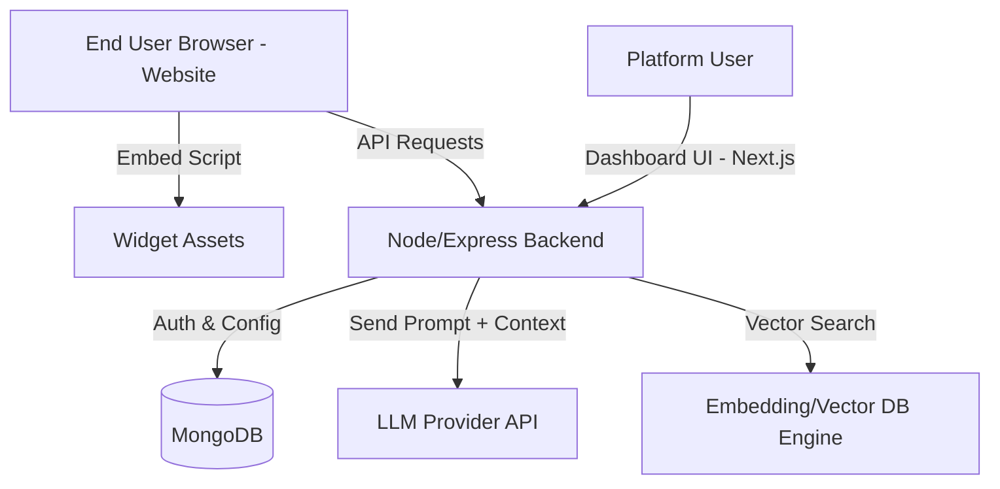
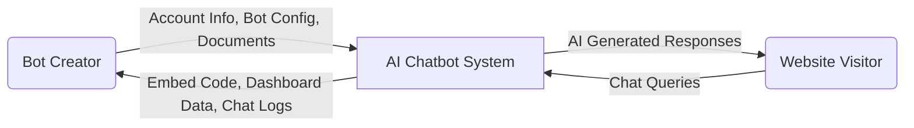
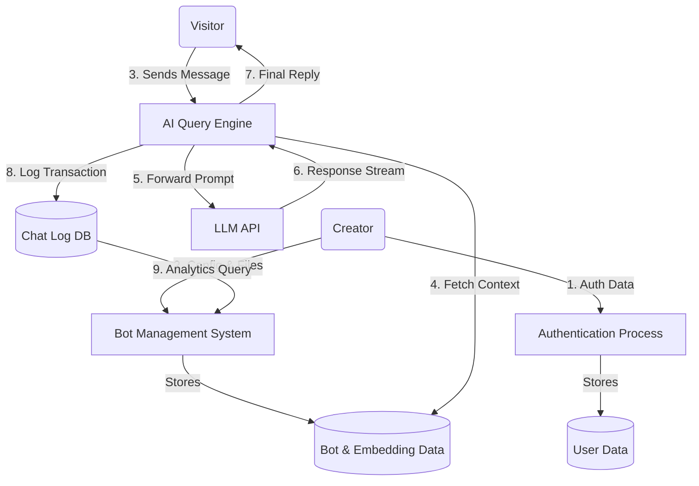
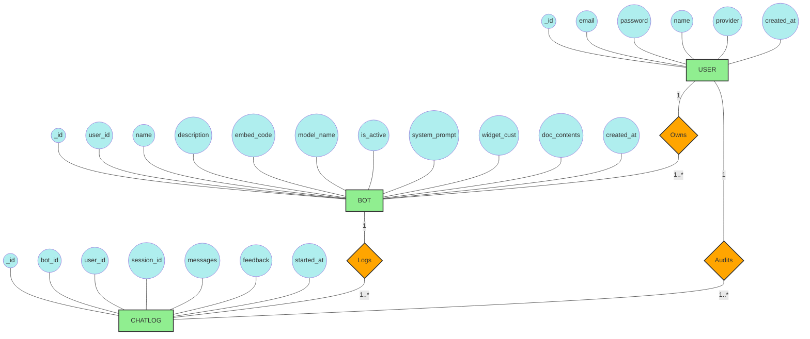

# Software Requirements Specification (SRS)
**Project Name**: AI Chatbot Builder
**Version**: 1.0

---

## 1. Introduction

### Purpose
The purpose of this Software Requirements Specification (SRS) is to provide a comprehensive, authoritative description of the AI Chatbot Builder system. This document delineates the expected feature sets, system boundaries, user interfaces, database architecture, and strict non-functional constraints required to successfully deploy and maintain the platform. By establishing a shared baseline, this SRS serves as the definitive reference guide and "single source of truth" for software engineers, quality assurance testers, project managers, and key stakeholders. It explicitly outlines the system's capabilities, guides the development lifecycle, and aids in long-term maintenance and future feature iterations.

### Scope
The AI Chatbot Builder is a comprehensive full-stack Software-as-a-Service (SaaS) platform designed to democratize access to advanced conversational AI. It empowers business owners, content creators, and organizations to effortlessly generate, deeply customize, and seamlessly embed intelligent AI agents directly into their external websites—all without requiring extensive programming knowledge.

The core value proposition of the platform is its ability to deliver hyper-relevant, context-aware automated interactions. To achieve this, the system permits users to upload proprietary, domain-specific text and documentation. It integrates powerful, state-of-the-art Large Language Models (LLMs) powered by a robust Retrieval-Augmented Generation (RAG) pipeline. This underlying architecture ingests the uploaded data, generates semantic vector embeddings, and retrieves precisely matched context during active user conversations. Ultimately, the system significantly reduces manual customer support overhead, delivers immediate 24/7 assistance to website visitors, and provides detailed analytics to bot creators regarding conversation trends and engagement metrics.

### Document Overview
This document is methodically structured to provide a logical progression from high-level behavioral goals to deep technical implementations:
- **Section 2 (Functional Requirements)**: Details the explicit behavioral actions the system must perform, segmented by the Creator, End-User, and Core System modules.
- **Section 3 (Non-Functional Requirements)**: Defines the performance, security, usability, and reliability constraints the system must adhere to under operational load.
- **Section 4 (System Architecture)**: Outlines the chosen technology stack and visualizes the high-level communications between the frontend, backend, LLMs, and persistent databases.
- **Sections 5 & 6 (Use Case and Data Flow Diagrams)**: Illustrate the specific pathways through which structural actors interact with the system and how actionable data propagates across modules.
- **Sections 7 & 8 (ER Diagram & Database Design)**: Provide an exact, strictly-typed blueprint of the database schema mapping out the Users, Bots, and ChatLogs collections.

---

## 2. Functional Requirements

### User/Creator Module
- **User Authentication**: Users can register, log in, and securely authenticate using email/password or OAuth providers.
- **Bot Creation & Configuration**: Users can create multiple chatbots, assign a system prompt, configure the welcome message, and define the underlying AI model.
- **Knowledge Base Management**: Users can upload text or documents. The system processes this data into text chunks and generates embeddings for AI context retrieval.
- **Widget Customization**: Users can fully customize their chatbot interface, including avatars, primary colors, theme aesthetics, position on the screen, and overall dimensions.
- **Bot Integration**: The system generates a unique embed URL and `<script>` code snippet for users to embed the chatbot directly into their external websites.
- **Dashboard & Analytics**: Users can view the usage data of their bots, including recent chat logs and interaction metrics.

### End-User (Chatbot User) Module
- **Chat Interface**: A clean, accessible chat window on the creator's website.
- **Real-time Interaction**: Users send messages and receive AI-generated, streaming (or standard) responses derived from the creator's knowledge base.
- **Session Tracking**: Anonymous sessions are tracked logically to maintain conversational context during a single visit.

### System Module
- **Context Retrieval (RAG)**: The system matches user queries against the bot's document embeddings and injects relevant data into the prompt context.
- **Chat History Logging**: The system automatically captures and saves chat transcripts for analysis by the bot creator.

---

## 3. Non-Functional Requirements

### Performance
- **Response Time**: The API and database queries must respond within 500ms to ensure a snappy user experience. The AI generation process should typically start streaming / returning within 1-2 seconds.
- **Scalability**: The backend must support concurrent requests from potentially thousands of distributed chatbot widgets embedded across different websites.

### Security
- **Authentication**: JWT (JSON Web Tokens) or secure session cookies are utilized for user access control.
- **Data Isolation**: A user must only have access to bots and chat logs explicitly tied to their User ID.
- **CORS Configuration**: The backend must strictly enforce CORS for sensitive API endpoints while allowing open cross-origin access for the public chatbot widget embeds.
- **Content Security**: Passwords must be hashed (using bcrypt or similar) before database insertion.

### Usability
- **Intuitive UI/UX**: The application must incorporate a fluid, responsive frontend capable of adapting to varying screen sizes (mobile, tablet, desktop).
- **Ease of Integration**: The embed process must be simplified to a simple copy-paste of a script tag without requiring programming knowledge from the base user.

### Reliability
- **System Uptime**: Expected availability is 99.9%.
- **Error Handling**: The application should degrade gracefully. If the AI model fails to reply, the chatbot widget should display a user-friendly fallback error message rather than a blank screen.

---

## 4. System Architecture

### Frontend
- Built primarily with **React.js / Next.js**.
- Structured with modular React Components.
- Utilizes **Tailwind CSS** for rapid and responsive styling.

### Backend
- Built with **Node.js** and **Express.js**.
- Provides a robust REST API for authentication, user management, and AI interaction.
- Handles embedding generation, file processing, and interactions with external LLM APIs (e.g., HuggingFace, OpenAI).

### Database
- **MongoDB** via Mongoose for flexible, document-based storage. (With considerations built-in for relational mappings).
- Data is normalized into three core entities: Users, Bots, and ChatLogs.

### Architecture Diagram (Mermaid)


---

## 5. Use Case Diagram & Description

```mermaid
usecaseDiagram
    actor "Bot Creator" as Creator
    actor "Website Visitor" as Visitor
    
    rectangle "AI Chatbot Builder" {
        usecase "Register/Login" as UC1
        usecase "Create & Customize Bot" as UC2
        usecase "Upload Knowledge Data" as UC3
        usecase "Get Embed Code" as UC4
        usecase "View Analytics & Logs" as UC5
        
        usecase "Interact with Chatbot" as UC6
        usecase "Send AI Response" as UC7
    }
    
    Creator --> UC1
    Creator --> UC2
    Creator --> UC3
    Creator --> UC4
    Creator --> UC5
    
    Visitor --> UC6
    UC6 --> UC7
```

**Description:**

- **Bot Creator (Administrator)**: The administrative user who registers on the platform to build and manage chatbot deployments. Their robust feature set allows them to customize the widget's visual identity, upload domain-specific documents strictly used to construct the AI's contextual knowledge base, extract seamless embedding scripts for site integration, and actively audit chat logs to monitor overall chatbot performance and conversation quality.
- **Website Visitor (End User)**: The public-facing consumer who seamlessly interacts with the embedded chatbot widget hosted on the Creator's external website. Operating without required authentication, they submit natural language queries and receive intelligent, real-time, and context-aware responses derived securely from the Creator's custom-built database.

---

## 6. Data Flow Diagram

### Level 0 DFD (Context Diagram)



### Level 1 DFD



---

## 7. ER Diagram (Entity-Relationship)



---

## 8. Database Design (Table Structure)

Given the NoSQL nature of MongoDB with Mongoose definitions, here is the structured schema design:

### Collection: `users`
| Field | Type | Attributes | Description |
|---|---|---|---|
| `_id` | ObjectId | Primary Key | Unique user identifier |
| `email` | String | Required, Unique | User's email address |
| `password` | String | Optional | Hashed password. Optional for OAuth |
| `name` | String | Required | Display name of the user |
| `provider` | String | Default: 'email' | Auth provider method |
| `created_at` | Date | Default: Date.now | Account creation timestamp |

### Collection: `bots`
| Field | Type | Attributes | Description |
|---|---|---|---|
| `_id` | ObjectId | Primary Key | Unique bot identifier |
| `user_id` | ObjectId | Foreign Key (Users) | The creator of the bot |
| `name` | String | Required | Friendly name for the bot |
| `embed_code` | String | Required, Unique | Public UUID used for JS widget embedding |
| `system_prompt`| String | Default value | The underlying instructions for the LLM |
| `document_contents`| Array | Optional | Contains `{text, embedding}` data blocks for RAG |
| `widget_customization`| Object | Options | Includes avatar URL, primary color, size, etc. |
| `model_name` | String | Default: 'standard' | The identifier of the specific AI model to query |
| `is_active` | Boolean | Default: true | Soft toggle to disable a bot globally |

### Collection: `chatlogs`
| Field | Type | Attributes | Description |
|---|---|---|---|
| `_id` | ObjectId | Primary Key | Unique log identifier |
| `bot_id` | ObjectId | Foreign Key (Bots) | The bot that handled this conversation |
| `session_id`| String | Required, Unique | Identifies a continuous anonymous user session |
| `user_id` | ObjectId | Foreign Key (Users) | (Optional) Logged-in user if testing internally |
| `messages` | Array | Required | Array of `{role, content, timestamp}` pairs |
| `feedback` | Object | Optional | Stores `{rating, comment}` from widget feedback |
| `started_at`| Date | Default: Date.now | Indicates when the chat session started |

---

## 9. Conclusion
This SRS accurately depicts the foundation of the AI Chatbot Builder application. By adhering to these specifications in the areas of architecture, behavior, and database schema, the development team is well-positioned to maintain, iterate upon, and scale the current implementation to effectively bridge the gap between AI capabilities and simple web integration for business owners.
