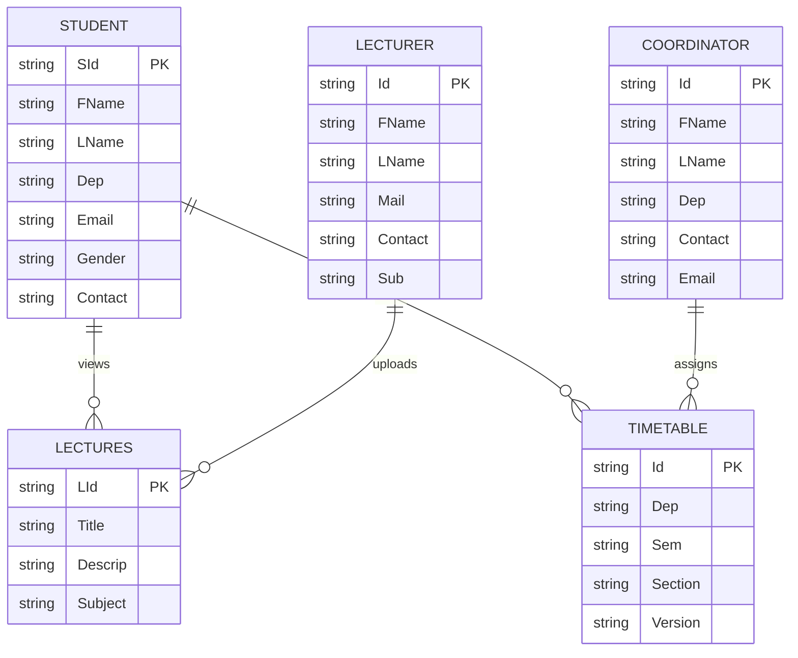

# University Management System - ER Diagram

This document contains the Entity-Relationship Diagram (ERD) for the University Management System, as per the provided specification.

## 1. Visual ER Diagram (Chen's Notation)

This diagram mimics the visual style of your reference image, using rectangles for entities, diamonds for relationships, and ovals for attributes.

```mermaid
flowchart TD
    %% Entities
    Student[Student]
    Lectures[Lectures]
    Timetable[Timetable]
    Coordinator[Coordinator]
    Lecturer[Lecturer]

    %% Relationships
    Views1{Views}
    Views2{Views}
    Assigns{Assigns}
    Upload{Upload}

    %% Attributes - Student
    S_Dep((Dep)) --- Student
    S_FName((FName)) --- Student
    S_LName((LName)) --- Student
    S_Email((Email)) --- Student
    S_Gender((Gender)) --- Student
    S_Contact((Contact)) --- Student
    S_SId((SId)) --- Student

    %% Attributes - Lectures
    L_Title((Title)) --- Lectures
    L_Descrip((Descrip)) --- Lectures
    L_Subject((Subject)) --- Lectures
    L_LId((L.Id)) --- Lectures

    %% Attributes - Timetable
    T_Id((Id)) --- Timetable
    T_Dep((Dep)) --- Timetable
    T_Sem((Sem)) --- Timetable
    T_Section((Section)) --- Timetable
    T_Version((Version)) --- Timetable

    %% Attributes - Coordinator
    C_Id((Id)) --- Coordinator
    C_FName((FName)) --- Coordinator
    C_LName((LName)) --- Coordinator
    C_Dep((Dep)) --- Coordinator
    C_Contact((Contact)) --- Coordinator
    C_Email((Email)) --- Coordinator

    %% Attributes - Lecturer
    Lec_FName((FName)) --- Lecturer
    Lec_Id((Id)) --- Lecturer
    Lec_LName((LName)) --- Lecturer
    Lec_Mail((Mail)) --- Lecturer
    Lec_Contact((Contact)) --- Lecturer
    Lec_Sub((Sub)) --- Lecturer

    %% Connections with Cardinality
    Student -- "1..*" --- Views1
    Views1 -- "1..*" --- Lectures
    
    Student -- "1..*" --- Views2
    Views2 -- "1" --- Timetable
    
    Coordinator -- "1" --- Assigns
    Assigns -- "1..*" --- Timetable
    
    Lecturer -- "1" --- Upload
    Upload -- "1..*" --- Lectures

    %% Styling
    style Student fill:#90EE90,stroke:#333,stroke-width:2px
    style Lectures fill:#90EE90,stroke:#333,stroke-width:2px
    style Timetable fill:#90EE90,stroke:#333,stroke-width:2px
    style Coordinator fill:#90EE90,stroke:#333,stroke-width:2px
    style Lecturer fill:#90EE90,stroke:#333,stroke-width:2px

    style Views1 fill:#FFA500,stroke:#333,stroke-width:2px
    style Views2 fill:#FFA500,stroke:#333,stroke-width:2px
    style Assigns fill:#FFA500,stroke:#333,stroke-width:2px
    style Upload fill:#FFA500,stroke:#333,stroke-width:2px

    style S_Dep fill:#AFEEEE
    style S_FName fill:#AFEEEE
    style S_LName fill:#AFEEEE
    style S_Email fill:#AFEEEE
    style S_Gender fill:#AFEEEE
    style S_Contact fill:#AFEEEE
    style S_SId fill:#AFEEEE
    
    style L_Title fill:#AFEEEE
    style L_Descrip fill:#AFEEEE
    style L_Subject fill:#AFEEEE
    style L_LId fill:#AFEEEE
    
    style T_Id fill:#AFEEEE
    style T_Dep fill:#AFEEEE
    style T_Sem fill:#AFEEEE
    style T_Section fill:#AFEEEE
    style T_Version fill:#AFEEEE
    
    style C_Id fill:#AFEEEE
    style C_FName fill:#AFEEEE
    style C_LName fill:#AFEEEE
    style C_Dep fill:#AFEEEE
    style C_Contact fill:#AFEEEE
    style C_Email fill:#AFEEEE
    
    style Lec_FName fill:#AFEEEE
    style Lec_Id fill:#AFEEEE
    style Lec_LName fill:#AFEEEE
    style Lec_Mail fill:#AFEEEE
    style Lec_Contact fill:#AFEEEE
    style Lec_Sub fill:#AFEEEE
```

## 2. Technical Database Schema (Crow's Foot Notation)

This version uses standard industrial notation for clear relationship mapping.

